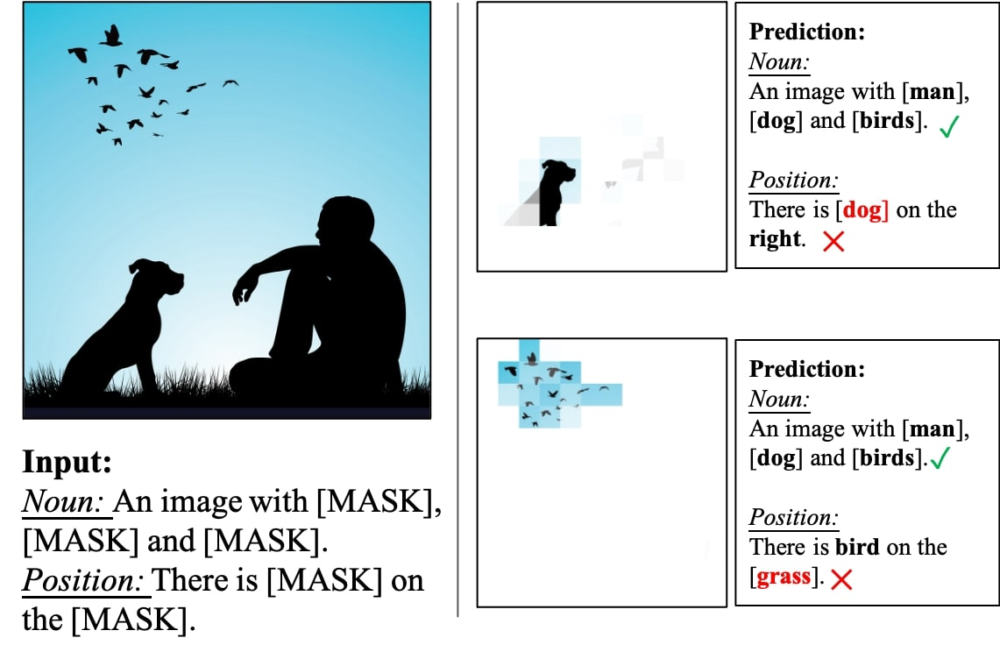
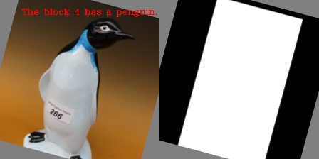

# PTP

[](
https://paperswithcode.com/sota/zero-shot-cross-modal-retrieval-on-coco-2014?p=position-guided-text-prompt-for-vision)

[](
https://paperswithcode.com/sota/cross-modal-retrieval-on-coco-2014?p=position-guided-text-prompt-for-vision)


[](
https://paperswithcode.com/sota/image-captioning-on-coco-captions?p=position-guided-text-prompt-for-vision)


[](
https://paperswithcode.com/sota/zero-shot-cross-modal-retrieval-on-flickr30k?p=position-guided-text-prompt-for-vision)


This repository includes implementations of the following method:

- [Position-guided Text Prompt for Vision Language Pre-training](https://arxiv.org/abs/2212.09737)

## Introduction
The goal of Position-guided Text Prompt (PTP) is to bring position information into conventional Vision-Language Pre-training (VLP) models, as current mainstream e2e VLP models ignore this important cues.


<p align="center">
  
</p>

We observe **Position information is missed in a well-trained ViLT models.**

<!--  -->
<p align="center">
  
</p>

**Our method provide a good altentive for existing object feature based methods (BUTD and the following works).**

An example of one _PTP_ is show below:
<p align="center">
  
</p>

## Updates

- 2023.3 The Pre-training Code is released.
- 2023.1 We have put the pretrained and fine-tuned weight on huggingface for fast download.
- 2022.12 The first version of downstream evaluation code based on BLIP and pretrained/down-stream weight is released! The pre-training code is in cleaning up now.


##  Installation

Please find installation instructions for PyTorch in [INSTALL.md](INSTALL.md).


## Dataset Preparation

You may follow the instructions in [DATASET.md](DATASET.md) to prepare the datasets.
Considering the dataset prepartion is very time consuming, we provide detail guidence and provided our trained corpus.


## Pretrained & Finetune Models
### 1. Pre-trained Model

| Method | Vision Encoder  | #Images | Dataset   | Pretrained Weights |    Training Logs  |
| :---   | :--- | :--- | :---   |    :----:   |          :---: |
| PTP-BLIP| ViT-B(DeiT) | 4M   | CC3M+COCO+VG+SBU | [link](https://huggingface.co/sail/PTP/blob/main/Pretrain_concated_pred_4m.pth)      | [link](https://huggingface.co/sail/PTP/blob/main/4M_pretrain.txt)  |

### 2. Zero-shot & Fine-tuning Downstream Model


#### 2.1 Captioning
| Task | B@4 | CIDEr | Model Weight  | Training Logs | Config    |
| :---   |  :---   | :---  |          ---: | ---: | :---: |
| PTP-BLIP| 42.5 | 145.2 | [link](https://huggingface.co/sail/PTP/blob/main/coco_captioning_checkpoint_best.pth)      | [link](https://huggingface.co/sail/PTP/blob/main/4M_ptp_coco_captioning.txt)      | configs/caption_coco.yaml |


#### 2.2 Zero-shot Retrieval

##### 2.2.1 COCO
| Task | I2T@1 | T2I@1 | Model Weight  | Training Logs | Config    |
| :---   |  :---   | :---  | :---   | :---  |          :---: |
| Zero-shot Retrieval(COCO)| 72.3 | 49.5 | [link](https://huggingface.co/sail/PTP/blob/main/zero_shot_coco_checkpoint_4m.pth)      | [link](https://huggingface.co/sail/PTP/blob/main/4M_ptp_coco_zero_shot.txt)      | configs/retrieval_coco.yaml  |


##### 2.2.2 Flickr30K

| Method |  I2T@1 | T2I@1 | Model Weight  | Training Logs | Config    |
| :---   |  :---   | :---  |  :---   | :---  |          :---: |
| PTP-BLIP| 86.4 | 67.0 |  [link](https://huggingface.co/sail/PTP/blob/main/zero_shot_coco_checkpoint_4m.pth)   | [link](https://huggingface.co/sail/PTP/blob/main/4M_ptp_flickr30k_zero_shot.txt)      | configs/retrieval_flickr.yaml  |


#### 2.3 Retrieval (Fine-tune)

Tip: Please use as large batch size as possible, we experimentally find that the larger batch size leads to better result for this task. Due to memory limiation, we use batch size 24 rather than 28 in original implmentation.


##### 2.3.1 COCO
| Method |I2T@1 | T2I@1 | Model Weight  | Training Logs | Config    |
| :---   |  :---   | :---  |     :---   | :---  |        :---: |
| PTP-BLIP| 83.1 | 67.3 | [link](https://huggingface.co/sail/PTP/blob/main/coco_retrieval_ft_4m.pth)      | [link](https://huggingface.co/sail/PTP/blob/main/4M_ptp_coco_ft.txt)      | configs/retrieval_coco.yaml  |


##### 2.3.2 Flickr30K
| Method |I2T@1 | T2I@1 | Model Weight  | Training Logs | Config    |
| :---   | :---   | :---  |  :---   | :---  |          :---: |
| PTP-BLIP|  96.1 | 84.2 | [link](https://huggingface.co/sail/PTP/blob/main/flickr30k_ft_4m.pth)      | [link](https://huggingface.co/sail/PTP/blob/main/4M_ptp_flickr30k_ft.txt)      | configs/retrieval_flickr.yaml  |

#### 2.4 VQA V2

| Method | Test-dev|Test-std |Model Weight  | Training Logs | Config    |
| :---   |  :---   | :---  | :---   | :---  |  :---: |
| PTP-BLIP| 76.02 | 76.18 | [link](https://huggingface.co/sail/PTP/blob/main/vqa_ft_4m.pth)      | [link](https://huggingface.co/sail/PTP/blob/main/4M_ptp_vqa_v2.txt)      | configs/vqa.yaml  |

#### 2.5 NLVR

| Method | Dev| Test-P | Model Weight  | Training Logs | Config    |
| :---   |  :---   | :---  | :---   | :---  |          :---: |
| PTP-BLIP| 80.45 | 80.70 | [link](https://huggingface.co/sail/PTP/blob/main/nlvr_ft_4m.pth)      | [link](https://huggingface.co/sail/PTP/blob/main/4M_ptp_nlvr.txt)      | configs/nlvr.yaml  |


## Quick Start

Follow the example in [GETTING_STARTED.md](GETTING_STARTED.md) to start playing vlp models with PTP.

## Transfer To Other Architectures

The PTP can easily transfer to other architectures without much effort. 
Specifically, change your base code with following two steps:

- Download or generate corpus in the same format as ours.
- Modify the dataset.py

Then train the model with original objectives.

## Ackowledgement
This work is mainly based on [BLIP](https://github.com/salesforce/BLIP) and [ViLT](https://github.com/dandelin/ViLT), thanks for these good baselines. 
We also refer [OSCAR](https://github.com/microsoft/Oscar) for ablation study and dataset preparation.

## License
PTP is released under the Apache 2.0 license.

## Contact

Email: awinyimgprocess at gmail dot com

If you have any questions, please email me or open an new issue.

## Citation
If you find our work helps, please use the following BibTeX entry for citation.

```
@article{wang2022ptp,
  title={Position-guided Text Prompt for Vision Language Pre-training},
  author={Wang, Alex Jinpeng and Zhou, Pan and Shou, Mike Zheng and Yan, Shui Cheng},
  journal={Proceedings of the IEEE/CVF Conference on Computer Vision and Pattern Recognition},
  year={2023}
}
```