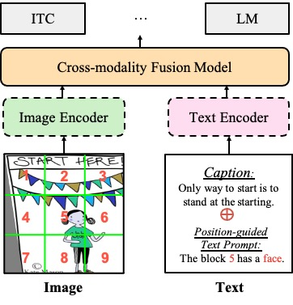

# PTP

[](
https://paperswithcode.com/sota/zero-shot-cross-modal-retrieval-on-coco-2014?p=position-guided-text-prompt-for-vision)
[](
https://paperswithcode.com/sota/cross-modal-retrieval-on-coco-2014?p=position-guided-text-prompt-for-vision)


This repository includes implementations of the following method:

- [Position-guided Text Prompt for Vision Language Pre-training](https://arxiv.org/abs/2212.09737)

## Introduction
The goal of Position-guided Text Prompt (PTP) is to bring position information into conventional Vision-Language Pre-training (VLP) models, as current mainstream e2e VLP models ignore this important cues.
_Our method provide a good altentive for existing object feature based methods (BUTD and the following works)._

**Position information is missed in a well-trained ViLT models (B).**
<!--  -->
<p align="center">
  
</p>


## Updates

- We have put the pretrained and fine-tuned weight on huggingface for fast download.
- The first version of downstream evaluation code based on BLIP is released! The pre-training code and evaluation code based on ViLT is in cleaning up now.


##  Installation

Please find installation instructions for PyTorch in [INSTALL.md](INSTALL.md).


## Dataset Preparation

You may follow the instructions in [DATASET.md](DATASET.md) to prepare the datasets.
Considering the dataset prepartion is very time consuming, we provide detail guidence and provided our trained corpus.


## Model Zoo
We provide a large set of baseline results, pre-trained models and fine-tune models in PTP [MODEL_ZOO](MODEL_ZOO.md).


## Quick Start

Follow the example in [GETTING_STARTED.md](GETTING_STARTED.md) to start playing vlp models with PTP.

## Transfer To Other Architectures

The PTP can easily transfer to other architectures without much effort. 
Specifically, change your base code with following two steps:

- Download or generate corpus in the same format as ours.
- Modify the dataset.py

Then train the model with original objectives.

## Ackowledgement
This work is mainly based on [BLIP](https://github.com/salesforce/BLIP) and [ViLT](https://github.com/dandelin/ViLT), thanks for these good baselines. 
We also refer [OSCAR](https://github.com/microsoft/Oscar) for ablation study and dataset preparation.

## License
PTP is released under the Apache 2.0 license.

## Contact

Email: awinyimgprocess at gmail dot com

If you have any questions, please email me or open an new issue.

## Citation
If you find our work helps, please use the following BibTeX entry for citation.

```
@article{wang2022ptp,
  title={Position-guided Text Prompt for Vision Language Pre-training},
  author={Wang, Alex Jinpeng and Zhou, Pan and Shou, Mike Zheng and Yan, Shui Cheng},
  journal={arXiv preprint arXiv:2212.09737},
  year={2022}
}
```